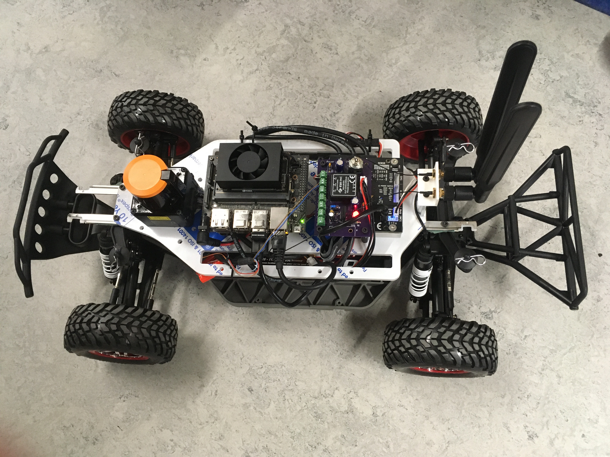

# MSc_Project_HW
# Evaluating the Performance of Different Reinforcement Learning Methods for Autonomous Racing

[[Dissertation](https://github.com/HL-Boisvert/MSc_Project_HW/blob/main/Dissertation/main.pdf)]
[[Videos of the evaluation of the DQN controllers on the physical car](https://bit.ly/3whXsn5)]

The simulator is from https://github.com/f1tenth/f1tenth_simulator  
The wall following controller is based on the code from the official F1Tenth lab n°3 at https://github.com/f1tenth/f1tenth_labs/tree/main/lab3  
The DQN controller is based on https://github.com/MichaelBosello/f1tenth-RL
The code is designed to run on [f1tenth cars](https://f1tenth.org/), both on the real car and the simulator.

The DQN implementation provides several techniques to improve performances like target network, replay buffer, state history, prioritized sampling. It has various parameters (see below) that one can modify to fit the specific environment. There are also various options to pre-process lidar data. One can use lidar data directly or represent them as images containing the environment borders. Velocity can be added to to the state

## Introduction
_Abstract_ &mdash; The increasing popularity of Reinforcement Learning over the last decade has transformed the AI field. One area that has benefited from this so-called deep learning revolution is autonomous driving and more specifically autonomous racing. Many Reinforcement Learning based controllers have been implemented with varying levels of success, to such an extent that it has become a challenge to find the method with the right compromise between performance and complexity of implementation. Furthermore, most implementations of Reinforcement Learning controllers for autonomous racing are trained in a simulated environment and assume that the Sim2Real gap won't have too much of an impact on performance: this is something that can have a considerable impact on the choice of a specific method for real-life applications.  
This project will have a double aim. Firstly, it will be to compare the performance of different autonomous racing controllers and their ability to generalise to new data to help users choose one that corresponds to their needs. Secondly, it will be to compare the Sim2Real gaps to give users an idea of performance in real-life situations; this will be achieved by using the F1Tenth platform. This research report details my review of the relevant literature and establishes research questions, hypotheses, objectives, and a well-defined experimental protocol.

## Experiments

Several experiments have been performed (more details are available in the dissertation) to answer all experimental requirements:

- NN comparison experiment: compares the performance of 1D CNN, 2D CNN, and fully-connected networks when used to detect LIDAR data
+ Sim2real experiment, Training on the physical car: training the agent directly in the real world using real LIDAR data as input
+ Sim2real experiment, Transfer learning: training the agent in the simulator and use the model in F1tenth car without any retraining thanks to our LIDAR pre-processing algorithm
+ F1 racetracks experiment: demonstrates the race-performance, sample efficiency, and generalization capability of DQN through simulations in challenging F1 racetracks

Tensorboard logging and trained models of experiments (of both real and simulated car) are provided in the release section. Maps used in simulated experiments are available in the */map* directory. If you want to use these maps, you must edit *simulator.launch* (see below) or copy the one provided in */map*

F1 track maps came from [this](https://github.com/CPS-TUWien/racing_dreamer) GitHub repo. You can find more maps [here](https://github.com/f1tenth/f1tenth_racetracks)

Sim2real experiments videos:

+ Training on the physical car

    A video showing the evolution of training and the evaluation of the real car in the sim2real experiment is available [here](https://youtu.be/ardg7-7Pevw)

+ Transfer learning

    Coming soon

## Installation

1) Install [ROS Melodic (desktop-full)](http://wiki.ros.org/melodic/Installation/Ubuntu)

2) Install the dependencies

    `$ sudo apt-get install python3-pip python3-yaml`

    `$ pip3 install rospkg catkin_pkg`

    `$ sudo apt-get install ros-melodic-ackermann-msgs`

3) __Optional__ dependencies

    You need to install these packets *only if* you want to use the relative function

    To use imitation learning through gamepad control (--gamepad=True):

    `$ pip3 install inputs`

    To visualize the images built from lidar data (lidar-to-image = True, show-image = True) you need opencv. *In the Jetson you must build the arm64 version*. In the simulator:

    `$ pip3 install opencv-python`

    To use compression of replay buffer (--compress-replay):

    `$ pip3 install blosc`

4) Setup the car *or* the simulator:
    + Real 1/10 scale car

        Follow the four tutorials (Building the car, system configuration, installing firmware, driving the car) at https://f1tenth.org/build.html to build and setup the car

        [**optional**] You need to add to the back of the car one or two IR sensors that are used to safely go backwards when an episode ends (because the hokuyo lidar covers only 270 degrees). Configure your pinout in the file *car/sensors.py*. The Orbitty Carrier has its own method to use gpio (i.e. bash commands). Check the numbers associated to the pins [here](http://connecttech.com/resource-center/kdb342-using-gpio-connect-tech-jetson-tx1-carriers/) and [here](http://connecttech.com/pdf/CTIM-ASG003_Manual.pdf). If you use the developer kit board, you have to implement the methods using Jetson.GPIO. If you use another board, find out how to use gpio and implement the methods.
        Alternatively, set backward seconds (in *car_control.py*) according to your track width, to avoid crashing.

    + Simulator

        `sudo apt-get install ros-melodic-map-server ros-melodic-joy`

        `$ mkdir -p simulator/src`

        `$ cd simulator/src`

        `$ git clone https://github.com/f1tenth/f1tenth_simulator.git`

        `$ cd ../`

        `$ catkin_make`

5) Install tensorflow 2.x

    + If you are on a *PC* (i.e. simulator)

        `$ pip3 install tensorflow`

    + In the real car, you need to install tensorflow for Jetson with Cuda (installed via JetPack)

        follow the [tutorial](https://docs.nvidia.com/deeplearning/frameworks/install-tf-jetson-platform/index.html) for your specific Jetson (verify that it will install at least v2.1.x, otherwise execute the upgrade command)

6) Clone this repo

    `$ git clone https://github.com/MichaelBosello/f1tenth-RL.git`

## Run

### Configurations

The parameters of the repo are configured for the simulator running on a PC with i7 processor (GPU is not used for Deep RL).

Check out the configurations for the **real car** and other envs at [EXPERIMENT_SETTING.md](EXPERIMENT_SETTING.md)

### Real car

> To let the control to the algorithm, you should change the **priority** of the control topics: edit the configuration of **low_level_mux.yaml** in f110_ws/f1tenth_system/racecar/racecar/config. Set priority of topic input/teleop to 1, input/safety to 2 and input/navigation to 3.

Launch the f1tenth system:
+ Go to the working directory of the f1tenth system (*/f110_ws*)

`$ source devel/setup.bash`

`$ roslaunch racecar teleop.launch`

Run the RL algorithm:

+ Go to the f1tenth-rl directory

 `$ python3 rl_car_driver.py`

### Simulator
Launch the f1tenth simulator:
+ Go to the working directory of the simulator (*/simulator*)

`$ source devel/setup.bash`

`$ roslaunch f1tenth_simulator simulator.launch`

Run the RL algorithm:

+ Go to the f1tenth-rl directory

`$ python3 rl_car_driver.py --simulator`

#### Simulator options:
+ The guide of the simulator is in the readme *simulator/src/f1tenth_simulator/README/md*

+ You may want to change the simulator options, check out *simulator/src/f1tenth_simulator/params.yaml*

+ If you want to change the track, you must edit *simulator/src/f1tenth_simulator/launch/simulator.launch*

    Search for `<arg name="map" default="$(find f1tenth_simulator)/maps/levine.yaml"/>`
    Change *levine* (the default map) with one map present in the folder *simulator/src/f1tenth_simulator/maps*

## Experimenting with parameters
You can change several parameters when you run the program as command-line arguments. Use *-h* to see the argument help. 
You can check the list of arguments and change their default value in *rl_car_driver.py*

You can change the model size and architecture by changing the function *__build_q_net* in *dqn.py*. We provide some networks: a fully connected and a CNN1D. We give also the possibility to represent lidar data as images (black/white with env borders) and process them with a CNN2D

You can change the behavior of the actions in *car_env.py*. You can change the actions available to the agent by updating the *action_set*

Keep in mind that to use a trained model, you must have the same network size, the same input (number and dimension of frame), and the same number of actions

If you want to limit the car velocity, modify the constants in *car/car_control.py*

### Load a model
You can use the --model argument to load a trained model, e.g.:

`python3 rl_car_driver.py --model=./run-real-car/models`

## Source code structure
The package *car* provides the interfaces to the car sensors (*sensors.py*) and actuators (*car_control.py*). It contains also a module that ensure the car will not (strongly) hit obstacles (*safety_control.py*). Finally, gamepad.py is used to retrieve gamepad commands during imitation learning.

*car_env.py* is the Reinforcement Learning environment.

*rl_car_driver.py* contains the training cycle.
*dqn.py* includes the NN and the DQN algorithm.

*state.py* creates states by preprocesing data and stacking them to form a history. It also provides the compression to save RAM.

*replay.py* manage the samples and the replay buffer.

*logging.py* write (if enabled) to a CSV all the states, actions, and rewards of every step to build a dataset for offline use. 

## Use on alternative cars/simulators

One can still use the dqn algorithm in alternative driving environments. You only need to implement your interfaces to the car sensors and actuators. To do so, implement your version of the files in the directory */car*. You are also free to not use ROS at all.

## Imitation Learning 

At the beginning of the training, it could be useful to provide a demonstration of how to drive to the agent. You can help the agent by piloting the car using a joystick. The agent will learn through imitation learning by your demonstration, and then you can switch back to RL to refine and improve the behavior of the agent.

To enable the use of imitation learning, set *--gamepad* to True.
*The following instructions refer to our joystick, you need to check the corresponding buttons of your joystick and modify the file gamepad.py if needed. Check out the corresponding 'event.code' by pressing your joystick buttons and modify the strings accordingly*

The agent starts in autonomous mode (RL). If you want to switch to manual control (i.e., imitation learning), press the button "A". Press it again to return to autonomous training (RL). Hold down "R2" to accelerate. Use the right analog stick to steer. "R2" works like a dead-man switch: if you release it, the car will stop and the agent will wait for your input.
